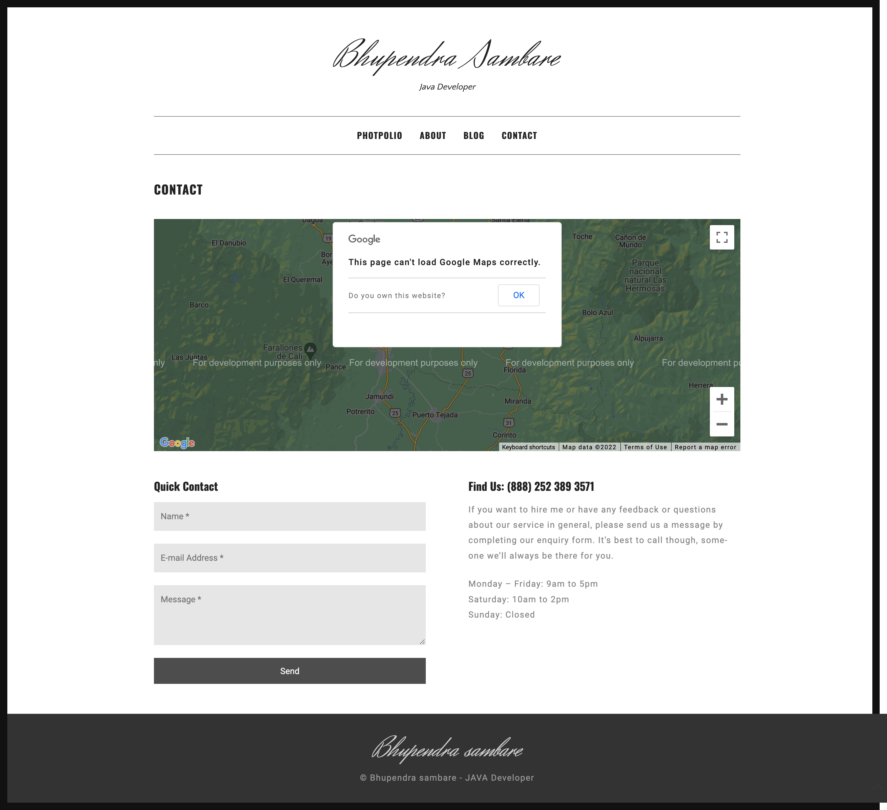

# Spring Boot Personal Blog
## Based on Spring Boot and Hibernate

A personal blog is a one-way communication blogging website where the client can share their thoughts with the people. He can add edit his portfolio, manage his application and get feedback through comments. We are using Hibernate H2 database for database management and bootstrap, JQuery for client side operations.

## Features

- String Boot
- Hibernate
- H2 - Databse
- Thymeleaf
- File management
- Java environmet

## The goal behing was followed -

> Applying java Spring boot
> 
> Hibernate Query Management
> 
> Database Management
> 
> File Management
> 
> Admin To User Communication

## Rquirements:
* apache maven 3.8.4

* java jdk 8 or 8+

## Start project

>unzip the project
>
>locate the folder in cmd/terminal
>
>run mvn spring-boot:run

### Important linkes: {H2- database}

> http://localhost:8080/h2-console [user:bhupendra password:password]
> 
## Screenshots

> http://localhost:8080/about </img>

> http://localhost:8080/blog </img>

> http://localhost:8080/contact </img>

> http://localhost:8080/index </img>

> http://localhost:8080/admin/blog </img>

> http://localhost:8080/admin/index </img>

> http://localhost:8080/admin/feedback </img>

> http://localhost:8080/admin/request </img>
